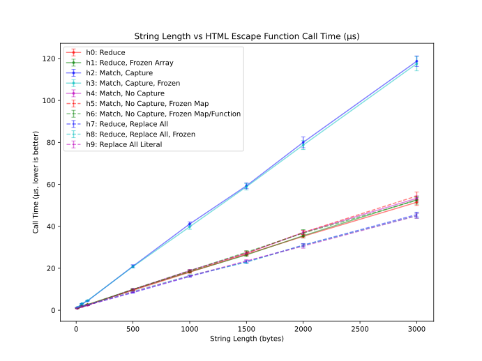
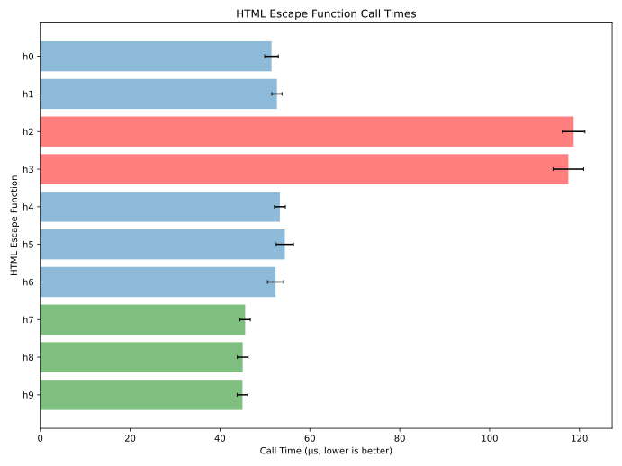

# Fastest JavaScript HTML Escape

Companion repository for [my "Fastest JavaScript HTML Escape"
post][post].

This repository contains a web-based tool to benchmark several
JavaScript HTML escape implementations and scripts to aggregate and plot
the results.

## Usage

### Run Benchmarks (Easy Way)

Go to [https://pmdn.org/fastest-js-html-escape/][site] and let the tool
run for long enough to accumulate at least 100 results for each
implementation.

Use the "Download" button on the left sidebar to download the raw
benchmark results as a [CSV][] file.

Continue to "Generate Charts".

### Run Benchmarks (Hard Way)

Serve the files in `public/` on a local port.  The tool uses the
[Performance API][] from a [web worker][], and [web workers][] cannot be
invoked from a `file:///` URL, so you'll need to serve the files in
`public/` with a local [HTTP][] server.  Example:

```sh
# serve public on port 8080
$ cd ./public && python3 -m http.server 8080
```

View `http://localhost:8080/` in your browser.  The tool will run all of
the benchmarks once to seed the browser's [JIT][], then automatically
start collecting benchmark results.

Let the benchmarks run for long enough to accumulate at least 100
results for each implementation.  While you're waiting, you can use the
panels on the left sidebar of the to run manual tests or configure the
automatic benchmarks.

After you have collected enough data, use the "Download" button on the
left sidebar to download the raw benchmark results as a [CSV][] file.

### Generate Charts

Run `bin/gen.rb` with the path to `results.csv` to generate the [SVGs][]
in `out/`.

**Tip:** [Matplotlib][] generates bloated [SVGs][svg]; if [minify][] is
installed, then `gen.rb` will use it to compress the generated
[SVGs][svg].

```sh
# aggregate results from "results.csv", write charts to "out/sizes.svg"
# and "out/times.svg"
$ bin/gen.rb results.csv
```

If you'd like to view the intermediate aggregate results, skip `gen.rb`
and do the following instead (again, assuming raw results in
`results.csv`):

```sh
# aggregate results, save as "stats.csv"
$ ruby bin/agg.py < results.csv > stats.csv

# generate line plot, save to "sizes.svg"
$ python3 bin/plot-line.py < stats.csv > sizes.svg

# (optional) save minified line plot as "sizes.min.svg"
$ minify -o sizes{.min,}.svg

# generate bar plot, save to "times.svg"
$ python3 bin/plot-barh.py < stats.csv > times.svg

# (optional) save minified bar plot as "times.min.svg"
$ minify -o times{.min,}.svg
```

If you'd like to generate larger [SVGs][svg], the Python scripts accept
an optional command-line argument.  Example:

```sh
# generate 3x line plot, save to "sizes-hd.svg"
$ python3 bin/plot-line.py 3.0 < stats.csv > sizes.svg

# (optional) save minified line plot as "sizes-hd.min.svg"
$ minify -o sizes-hd{.min,}.svg
```

## Results

My results (Lenovo Thinkpad X1 Carbon 9th Gen, Debian, 64-bit Chrome
99.0.4840.0, 2022-03-08) are shown below.





[web worker]: https://en.wikipedia.org/wiki/Web_worker
  "JavaScript that runs from a web page in a background thread."
[performance api]: https://developer.mozilla.org/en-US/docs/Web/API/Performance
  "DOM performance API."
[http]: https://en.wikipedia.org/wiki/Hypertext_Transfer_Protocol
  "HyperText Transfer Protocol"
[jit]: https://en.wikipedia.org/wiki/Just-in-time_compilation
  "Just In Time compiler."
[csv]: https://en.wikipedia.org/wiki/Comma-separated_values
  "Comma-separated value."
[svg]: https://en.wikipedia.org/wiki/Scalable_Vector_Graphics
  "Scalable Vector Graphics"
[minify]: https://github.com/tdewolff/minify
  "Minification tool and library written in Go."
[matplotlib]: https://matplotlib.org/
  "Python visualization library."
[post]: https://pablotron.org/2022/03/09/fastest-js-html-escape/
  "Fastest JavaScript HTML Escape blog post."
[site]: https://pmdn.org/fastest-js-html-escape/
  "Fastest JavaScript HTML Escape online benchmarking tool."
